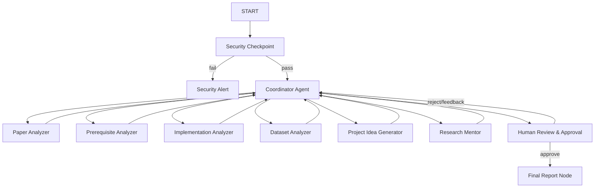

# Research Navigator AI — Submission Writeup

## Problem Statement

Reading and implementing research papers is a major barrier for students, junior developers, and early-career researchers. Academic papers contain complex terminology, rarely detail the necessary prerequisite concepts, omit the practical implementation difficulty, and lack structured dataset and codebase suggestions. 

While general-purpose LLMs can summarize text, they do not act as *mentors*. They cannot estimate the specific learning path required, verify custom code-building complexity, or provide structured project suggestions for students with varying skill levels.

Research Navigator AI solves this by coordinating specialized agents to evaluate paper feasibility, map learning curves, identify alternative datasets, generate multi-level projects, and get human approval on recommendation paths.

## Solution Architecture

Research Navigator AI uses an ADK 2.0 graph workflow:

## Concepts Used

1. **ADK Workflow**: Graph-based state machine containing functional nodes and routing edges defined in [app/agent.py](file:///c:/Users/HP/Downloads/AI%20agents/adk-workspace/research-navigator/app/agent.py#L330-L360).
2. **LlmAgent**: Six specialized agents (`paper_analyzer`, `prerequisite_analyzer`, `implementation_analyzer`, `dataset_analyzer`, `project_idea_generator`, `research_mentor`) configured with structured Pydantic output schemas in [app/agent.py](file:///c:/Users/HP/Downloads/AI%20agents/adk-workspace/research-navigator/app/agent.py#L50-L150).
3. **AgentTool**: Used by the `orchestrator` to delegate tasks to the six specialized sub-agents dynamically in [app/agent.py](file:///c:/Users/HP/Downloads/AI%20agents/adk-workspace/research-navigator/app/agent.py#L182-L195).
4. **MCP Server**: FastMCP server in [app/mcp_server.py](file:///c:/Users/HP/Downloads/AI%20agents/adk-workspace/research-navigator/app/mcp_server.py) providing local tools for checking prerequisites, dataset specifications, and complexity mappings.
5. **Security Checkpoint**: Initial node `security_checkpoint` in [app/agent.py](file:///c:/Users/HP/Downloads/AI%20agents/adk-workspace/research-navigator/app/agent.py#L225-L290) implementing PII filtering, prompt injection blocks, and audit logging.
6. **Agents CLI**: Project scaffolded with `agents-cli scaffold create` and configured with `pyproject.toml` and standard development lifecycles.

## Security Design

- **PII Scrubbing**: Sanitizes email and phone patterns from the query string to protect student and researcher privacy.
- **Prompt Injection Filter**: Employs keyword blocks (`ignore previous instructions`, etc.) to intercept jailbreaks before sending prompts to the coordinator and sub-agent LLMs.
- **Domain-Specific Check**: Ensures queries focus on academic topics and research papers, preventing the model from acting as a general-purpose chat interface (saving token quota).
- **Structured Audit Logging**: Outputs JSON logging for key system events (PII redactions, injection attempts, approvals) to allow centralized compliance tracking.

## MCP Server Design

Exposes three targeted local tools that act as a knowledge base to back sub-agent evaluations:
- `check_prerequisites(topic)`: Returns standard learning paths for core AI domains (Transformers, CNNs, GNNs) to ground the Prerequisite Agent.
- `check_dataset_spec(dataset_name)`: Returns size, accessibility status, and difficulty for popular datasets (BraTS, TCIA, ImageNet, CBIS-DDSM) to assist the Dataset Agent.
- `estimate_complexity(model_type)`: Returns typical implementation timelines and necessary framework dependencies (U-Net, ResNet, ViT, GPT-2) to ground the Implementation Agent.

## Human-in-the-Loop (HITL) Flow

A `RequestInput` interrupt node `human_review` is integrated directly after the `orchestrator` consolidates the report. 
This is critical because:
1. It allows the student to review the learning path, prerequisites, and difficulty assessments.
2. The user can either type `approve` to finalize and output the report, or type direct feedback (e.g. "I already know CNNs, adjust the prerequisite time").
3. Feedback triggers a loop back to the `orchestrator` with the user feedback stored in `ctx.state`, enabling the agents to update their analysis dynamically.

## Demo Walkthrough

The walkthrough tests the three primary user scenarios:
1. **Valid Academic Flow**: Querying `"Vision Transformers in Medical Imaging"` runs the entire pipeline, calls the MCP database, maps prerequisites, and presents a suitability rating.
2. **PII and Prompt Injection Block**: Queries containing injection payloads or PII trigger warnings and transition directly to the `Security Alert` terminal node.
3. **Out-of-Domain Block**: Non-academic questions (e.g., general trivia) are rejected by the security checkpoint to save LLM tokens.

## Impact / Value Statement

Research Navigator AI turns passive paper reading into active project-based learning. It empowers students to understand their readiness, obtain realistic schedules, and find accessible datasets, lowering the barrier to entry for early-career AI research.
