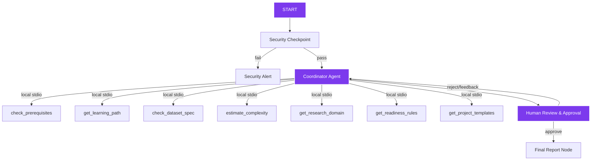

# Research Navigator AI — Submission Writeup

## Problem Statement

Reading and implementing research papers is a major barrier for students, junior developers, and early-career researchers. Academic papers contain complex terminology, rarely detail the necessary prerequisite concepts, omit the practical implementation difficulty, and lack structured dataset and codebase suggestions. 

While general-purpose LLMs can summarize text, they do not act as *mentors*. They cannot estimate the specific learning path required, verify custom code-building complexity, or provide structured project suggestions for students with varying skill levels.

Research Navigator AI solves this by coordinating specialized agents to evaluate paper feasibility, map learning curves, identify alternative datasets, generate multi-level projects, and get human approval on recommendation paths.

## Solution Architecture

Research Navigator AI has been optimized into a **Single-Agent Coordinator System** that directly interfaces with the local MCP server database tools, wrapped in a high-fidelity React SaaS client:

### Premium UI/UX Frontend Upgrade

The platform features a modern, deployment-ready React client and a custom FastAPI bridge:
1. **Landing Page**: Modern landing page with custom colors, blur gradients, and visual highlights.
2. **AI Workspace (SaaS Client)**: Real-time status tracker (e.g. `✓ Reading Paper`, `⟳ Estimating Complexity`) indicating node execution, combined with a chat window and inline Human Review checkpoints.
3. **Analysis Dashboard**: Six responsive expandable glassmorphic cards deconstructing research topics into Executive Summary, Prerequisites, Dataset Spec, Complexity, Suggested Projects, and Readiness analytics.
4. **Learning Roadmap**: An interactive weekly study timeline with progress indicators and checkboxes.
5. **NotebookLM-style Report View**: High-fidelity report view allowing Markdown copy and export.

## Concepts Used

1. **ADK Workflow**: Graph-based state machine containing functional nodes and routing edges defined in [app/agent.py](file:///c:/Users/HP/Downloads/AI%20agents/adk-workspace/research-navigator/app/agent.py).
2. **Single-Agent Coordinator**: The main `orchestrator` agent directly queries the 7 local MCP toolsets, performing all analysis and synthesis in a single Gemini LLM call. This completely avoids rate-limiting (429) and backend overloads (503) from sequential nested LLM loops.
3. **MCP Server**: FastMCP server in [app/mcp_server.py](file:///c:/Users/HP/Downloads/AI%20agents/adk-workspace/research-navigator/app/mcp_server.py) providing local tools for checking prerequisites, dataset specifications, complexity mappings, project templates, learning path weekly schedules, research domains, and readiness weights.
4. **Security Checkpoint**: Initial node `security_checkpoint` in [app/agent.py](file:///c:/Users/HP/Downloads/AI%20agents/adk-workspace/research-navigator/app/agent.py) implementing PII filtering, prompt injection blocks, shell/script injection detection, and audit logging.
5. **Agents CLI**: Project scaffolded with `agents-cli scaffold create` and configured with `pyproject.toml` and standard development lifecycles.

## Security Design

- **PII Scrubbing**: Sanitizes email and phone patterns from the query string to protect student and researcher privacy.
- **Prompt Injection Filter**: Employs keyword blocks (`ignore previous instructions`, etc.) to intercept jailbreaks before sending prompts to the coordinator and sub-agent LLMs.
- **System Command Guardrail**: RegEx pattern checks to intercept and block system command injection attempts, including `os.system`, `subprocess`, `exec(`, `eval(`, `rm -rf`, and shell pipeline operators (`| sh`, `| bash`).
- **Domain-Specific Check**: Ensures queries focus on academic topics and research papers, preventing the model from acting as a general-purpose chat interface (saving token quota).
- **Structured Audit Logging**: Outputs JSON logging for key system events (PII redactions, injection attempts, approvals) to allow centralized compliance tracking.

## MCP Server Design

Exposes seven targeted local tools that act as a knowledge base to back sub-agent evaluations:
- `check_prerequisites(topic)`: Returns standard learning paths for core AI domains (Transformers, CNNs, GNNs) to ground the Prerequisite Agent.
- `check_dataset_spec(dataset_name)`: Returns details, size, and availability for popular and medical datasets (BraTS, TCIA, ImageNet, CBIS-DDSM, Breast MRI Dataset, BUSI, HAM10000, PlantVillage, EuroSAT, Sentinel-2, Rice Leaf Disease).
- `estimate_complexity(model_type)`: Returns typical implementation timelines and necessary framework dependencies (U-Net, ResNet, ViT, GPT-2).
- `get_learning_path(topic)`: Retrieves structured weekly learning plans.
- `get_project_templates(topic)`: Fetches reference beginner/intermediate/advanced template projects.
- `get_research_domain(topic)`: Maps the topic to domain, subfield, and real-world impact.
- `get_readiness_rules(topic)`: Returns skill evaluation readiness weights.

## Human-in-the-Loop (HITL) Flow

A `RequestInput` interrupt node `human_review` is integrated directly after the `orchestrator` consolidates the report. 
This is critical because:
1. It allows the student to review the learning path, prerequisites, and difficulty assessments.
2. The user can either type `approve` to finalize and output the report, or type direct feedback (e.g. "I already know CNNs, adjust the prerequisite time").
3. Feedback triggers a loop back to the `orchestrator` with the user feedback stored in `ctx.state`, enabling the agents to update their analysis dynamically.

## Demo Walkthrough

The walkthrough tests the four primary user scenarios:
1. **Valid Academic Flow**: Querying `"Vision Transformers in Medical Imaging"` runs the entire pipeline, calls the MCP database, maps prerequisites, and presents a suitability rating.
2. **PII and Prompt Injection Block**: Queries containing injection payloads or PII trigger warnings and transition directly to the `Security Alert` terminal node.
3. **Execution Guardrail Block**: Queries containing shell instructions (e.g. `rm -rf /`) are blocked immediately by the security checkpoint functional node.
4. **Out-of-Domain Block**: Non-academic questions (e.g., general trivia) are rejected by the security checkpoint to save LLM tokens.

## Impact / Value Statement

Research Navigator AI turns passive paper reading into active project-based learning. It empowers students to understand their readiness, obtain realistic schedules, and find accessible datasets, lowering the barrier to entry for early-career AI research.
